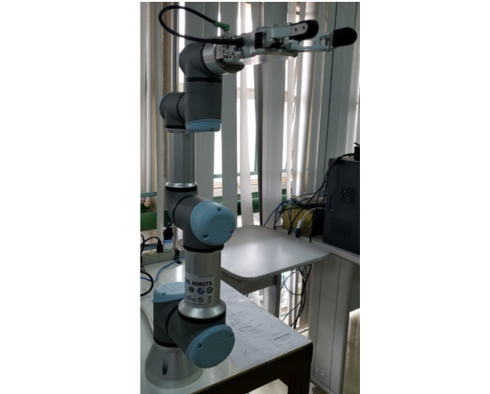

# catkin_ur3_ws
Este repositório é dedicado a armazenar códigos e documentação a respeito do manipulador UR3 presente no LARA.

## UR3
O UR3 , Figura 1 ,  é um robô colaborativo de mesa que possui carga útil de 3kg. Seu tamanho reduzido o torna adequado para situações onde o espaço de trabalho é limitado. Com seu giro infinito na junta final, diversas atividades podem ser realizadas com a garra fixada no conector da ferramenta do robô, o que o torna muito hábil.  

Figura 1: UR3

## interface de comunicação 

A Interface de Comunicação nada mas é do que um nó ROS, escrito em C++, que visa o desacoplamento entre a aplicação, que pode ser um controlador ou uma aplicação que envie trajetórias predefinidas, e o robô em si e tem a finalidade de funcionar como um intermediário entre uma aplicação ROS e o Software do fabricante.

Figura 2: Diagrama de comunicação

## descrição do blocos da Figura 2
-   Interface de Comunicação

    -   nós

        -   ur3

    -   tópicos

        -   ur3/arm

            -   função: publicar as posições, velocidade e torque das
                juntas do UR3

            -   tipo: publisher

            -   mensagem ROS: sensor\_msgs/JointState

                -   posição em radiano

                -   velocidade em rad/s

                -   Torque em N.m

            -   frequência: 125 hz

        -   ur3/ref\_vel

            -   função: subscrever os sinais de velocidade de uma
                aplicação externa e enviar para o UR3

            -   tipo: subscriber

            -   mensagem ROS: std\_msgs/Float64MultiArray

                -   velocidade em rad/s

            -   frequência: 125 hz

    -   serviços

        -   ur3/reset

            -   função: reiniciar a Interface de Comunicação e colocar o
                UR3 na posição de descanso

            -   mensagem ROS: std\_srvs/Trigger

-   Aplicação

    -   nós

        -   ur3\_control

    -   tópicos

        -   ur3/ref\_vel

            -   função: publicar os sinais de velocidade de referência
                para a Interface de Comunicação

            -   tipo: publisher

            -   mensagem ROS: std\_msgs/Float64MultiArray

                -   velocidade em rad/s

            -   frequência: 125 hz

        -   ur3/arm

            -   função: subscrever as posições, velocidade e torque das
                juntas enviadas pela Interface de Comunicação

            -   tipo: subscriber

            -   mensagem ROS: sensor\_msgs/JointState

                -   posição em radiano

                -   velocidade em rad/s

                -   Torque em N.m

            -   frequência: 125 hz

    -   serviços

        -   ur3\_control/start\_control

            -   função: habilitar ou desabilitar o controlador (**True**
                habilita e **False** desabilita)

            -   mensagem ROS: std\_srvs/SetBool

# Experimentos
Para mais detalhes sobre o funcionamento do UR3 e a Interface de Comunicação, consulte o trabalho de graduação do aluno Rafael R. Matos na pasta docs desse repositório. Para realizar alguns experimentos com o UR3 consulte a documentação de experimentos na pasta docs desse repositório. Na pasta docs, também há um projeto de pesquisa (pibit) que contém uma primeira versão da Interface de Comunicação, que está desatualizada, mas vale a pena para entender como foram feitas as primeiras propostas da Interface.

